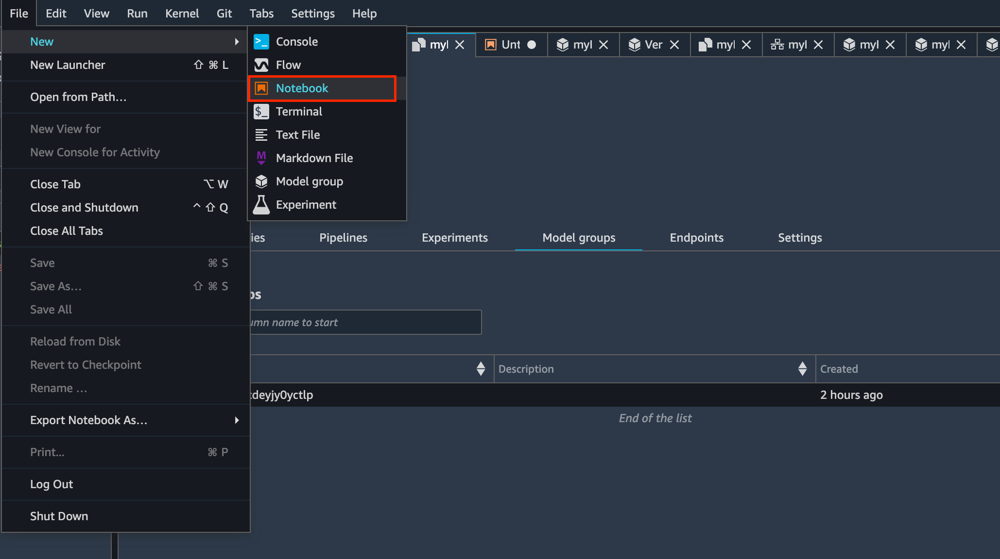

# 7. MLOps Project 리소스 정리

1. SageMaker Studio 메뉴에서 **파일** , **신규** , **노트북** 을 차례로 선택합니다 .**선택 커널** 대화 상자를 선택 **파이썬 3 \(데이터 과학\)** , 다음 선택합니다.



   2. 노트북에서 다음 코드를 셀에 입력 한 다음 셀을 실행합니다. '**MLOpsProject**' 프로젝트 이름으로 바꿉니다 . 프로젝트에서 생성 한 서비스 카탈로그 프로비저닝 된 제품이 삭제됩니다. 여기에는 프로젝트 용으로 생성 된 CodeCommit, CodePipeline 및 CodeBuild 리소스가 포함됩니다.

```python
import boto3

sm_client=boto3.client("sagemaker")
sm_client.delete_project(ProjectName="MLOpsProject")
```

    3. 프로젝트가 생성 한 AWS CloudFormation 스택을 삭제합니다. 2 개의 스택이 있습니다. 하나는 스테이징 용이고 다른 하나는 프로덕션 용입니다. 모두 지웁니다.

    4. 버킷안에 객체를 삭제한 후 버킷을 삭제합니다.

