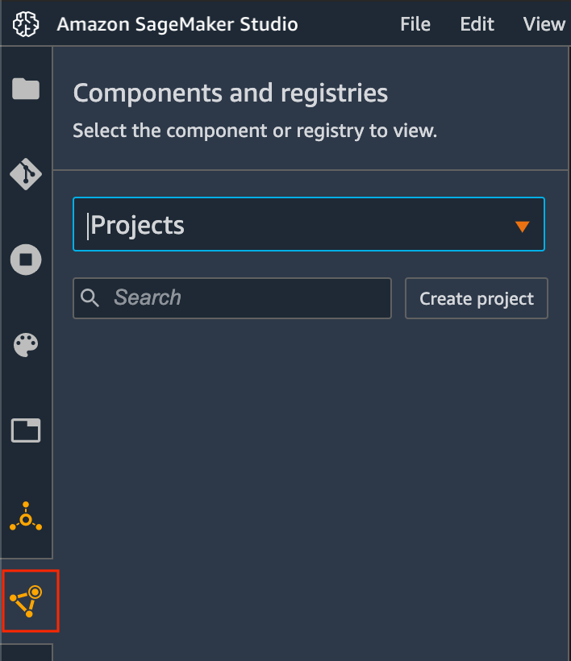
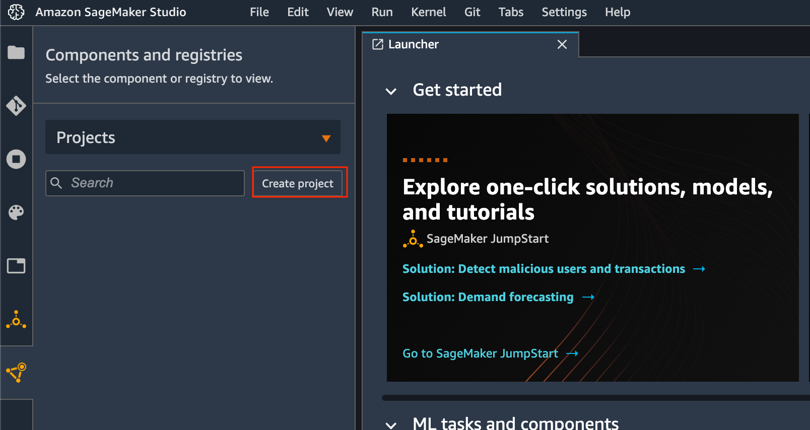
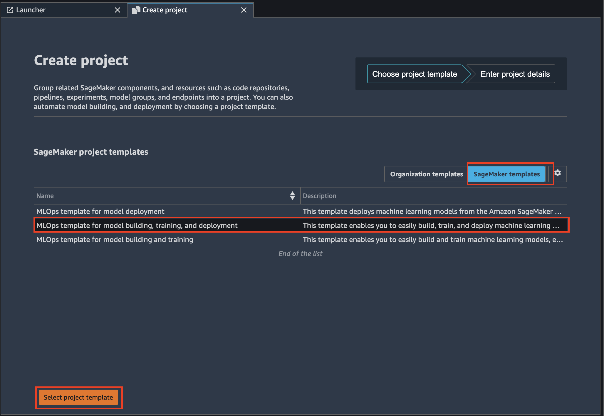
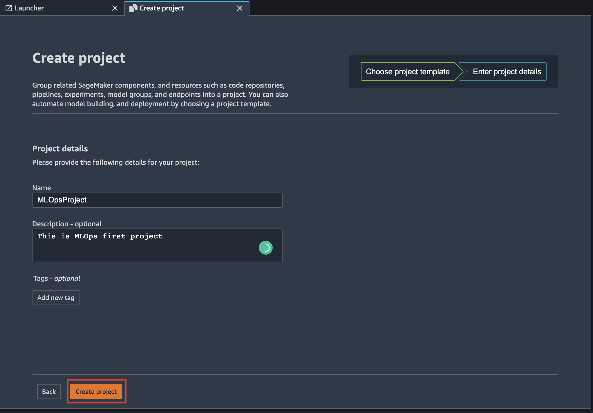
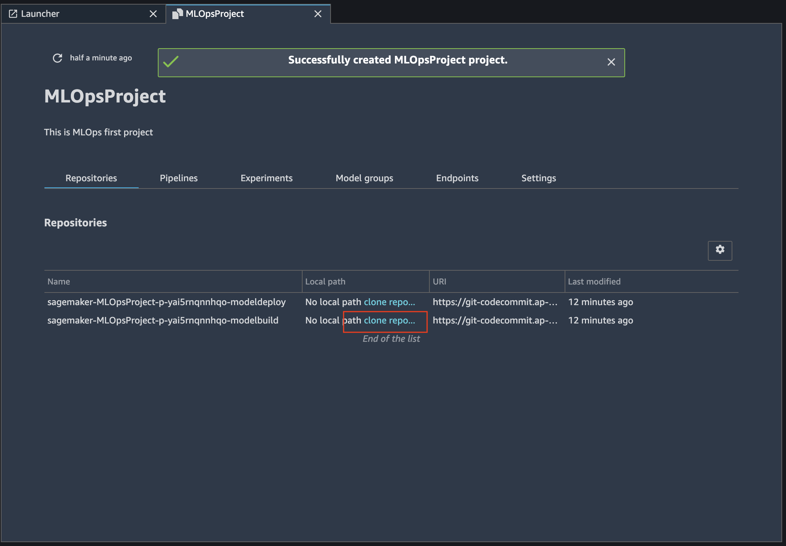
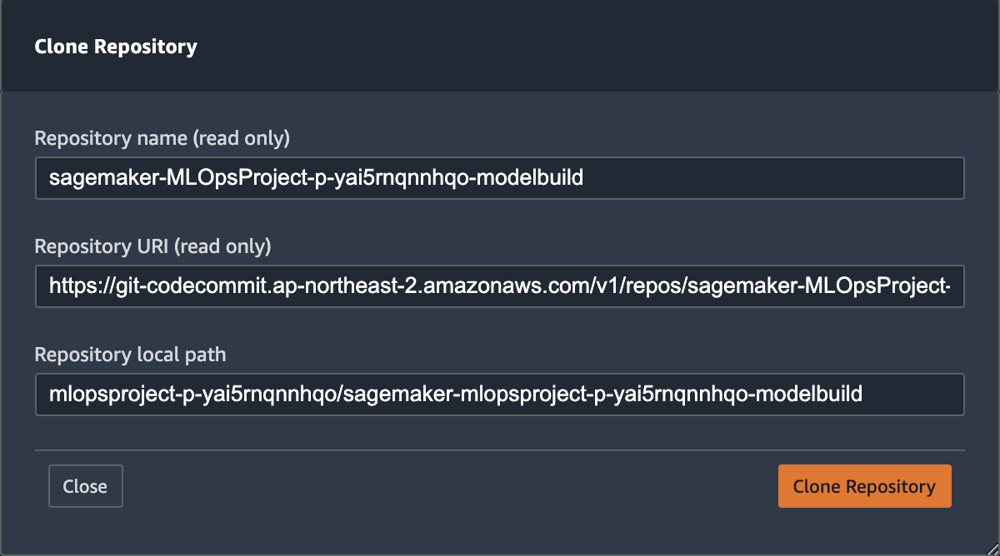
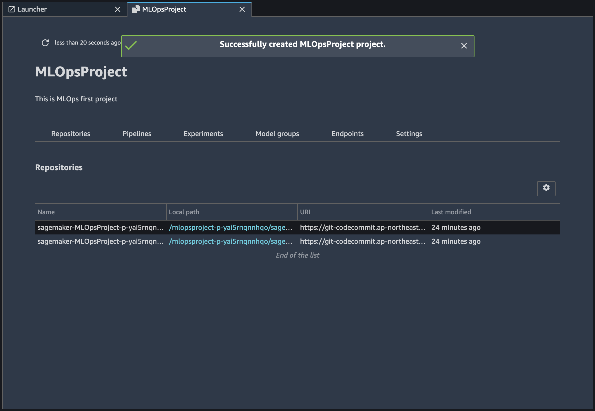

# 3. SageMaker MLOps 프로젝트 생성

 **SageMaker Studio에서 프로젝트를 생성하려면**

1. Studio에 로그인합니다. 자세한 내용은 [Amazon SageMaker Studio에 온보드를](https://docs.aws.amazon.com/sagemaker/latest/dg/gs-studio-onboard.html) 참조하십시오 .

* IAM역할 생성시 특정 S3 버킷을 선택하는것을 추천드리오나 여기선 모든 S3 버킷을 선택하고 '역할 생성'을 클릭합니다. 

2. 선택 **구성 요소 및 레지스트리를** 다음 선택 **프로젝트** 드롭 다운 목록에서 Project 선택합니다.

 3. **프로젝트 생성**을 선택합니다 .

 4. **SageMaker project template** 에 조직에서 만든 **Organization templates** 사용자 지정 서식 파일을 선택하거나 SageMaker에서 제공하는 **SageMaker templates**  템플릿을 선택합니다. 그런 다음 사용 가능한 템플릿 목록에서 **MLOps template for model building, training, and deployment**  템플릿을 선택하고 **Select project template** 버튼을 클릭합니다. \(3개중 사용자 선택\)

 5. **프로젝트 세부 사항** 프로젝트의 이름에 '**MLOpsProject**' 과 설명을 입력합니다. 선택적으로 프로젝트를 추적하는 데 사용할 수있는 키 값 쌍인 태그를 추가합니다. 완료되면 **프로젝트 생성을** 선택합니다. 


SageMaker Sudio에서 MLOps template을 이용하여 SageMaker Project를 만들었습니다. SageMaker Project 템플릿은 Service Catalog 에 등록되어 있습니다. 선택된 템플릿에서 프로젝트를 만들때 Service Catalog에 등록되어있는 CloudFormation이 리소스구성을 위해 실행됩니다.


 6. 성공적으로 구성이 완료되면 Repositories 에 해당 프로젝트의 modedeploy와 modelbuild가 생성됩니다. modelbuild로 사용할 repository구성을 위해 'clone repository'를 클릭합니다.

 7. Clone Repository 내용을 확인하신 후 Clone Repository를 클릭합니다.

 8. 같은 방법으로 modedeploy의 Clone Repository 내용을 확인하신 후 Clone Repository를 클릭하여 구성을 완료합니다.


MLOps 템플릿에서 프로젝트를 만들려면 코드의 변경을 감지하여 모델 학습에 대한 CodePipeline 을 실행해야 합니다. 코드저장소 복제를 위해 CodeCommit를 생성하고 CodeBuild에서 SageMaker Pipeline을 실행토록 구성하였습니다. 해당 구성은 Service Catalog 를 통해 Cloudformation으로 등록되어 있습니다. 


