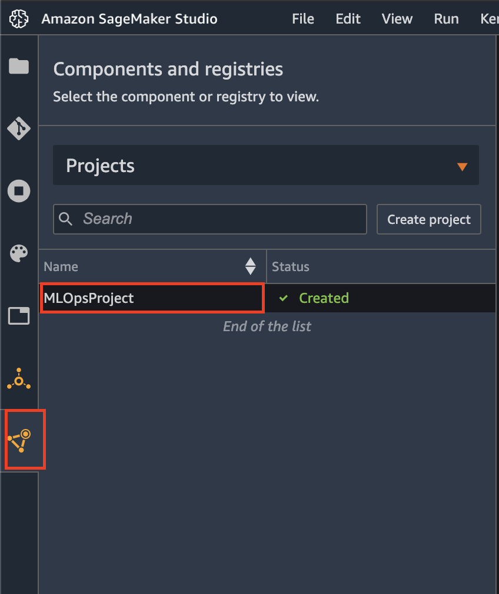
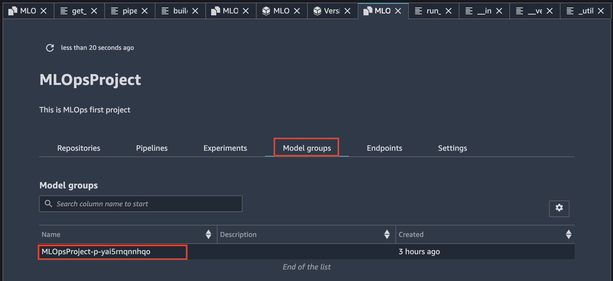
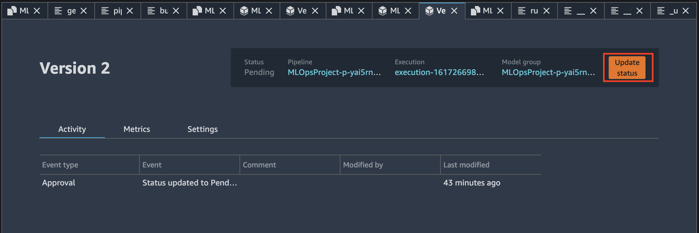
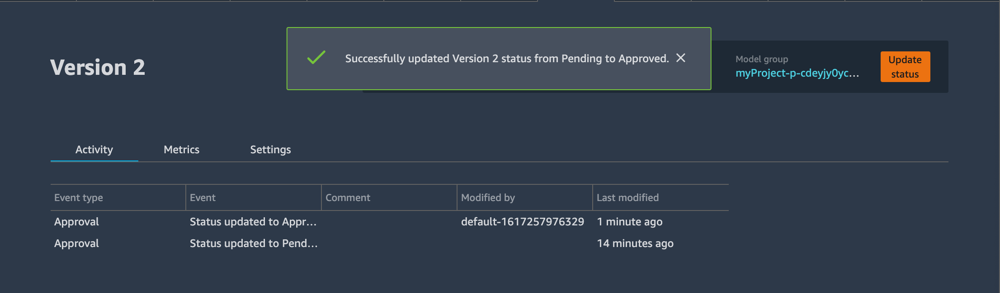

# 4. Model 승인

1. 외쪽 창에서 "Components and registeries" 버튼을 클릭합니다.
2. 방금 만든 프로젝트를 선택합니다.

   3. "Model groups"탭을 선택하여 Model Group을 클릭합니다.

   4. Version 2를 클릭합니다.


Version 2 생성은 어느시점에 생기나요? CodePipeline의 Modelbuild pipeline이 완료되어야 생성됩니다. 모델승인 담당자의 approve 대기상태라 보시면 됩니다.   


   5. 오른쪽 상단의 "Update status"를 클릭하여, 'Status'에서 'Approved'을 선택하고 'Update status'를 클릭합니다.


* SageMaker Pipelines의 Mode Registory의 Model Group에 등록된 모델을 승인했습니다. 
* EventBridge 는 모델승인을 감지하여 모델배포 용 CodePipeline이 실행되고 Staging 환경에 대한 추론 endpoint가 Deploy 되었습니다. 


