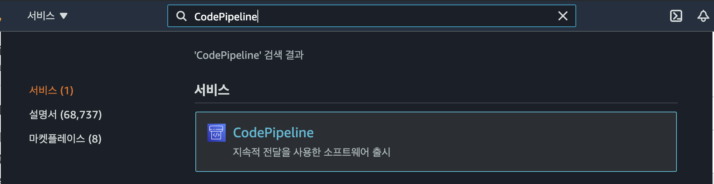
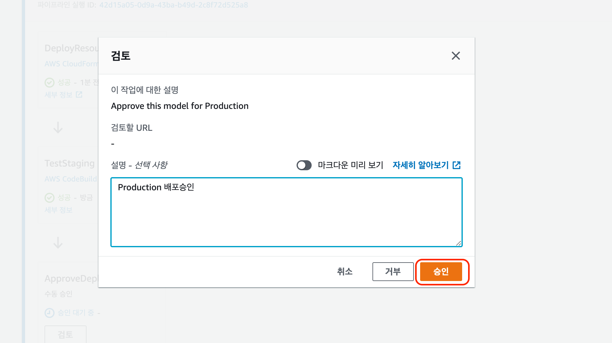

# 6. Staging 과 Production 배포

1. 웹콘솔 상단에 CodePipeline 으로 이동하여 '**파이프라인**'을 선택 합니다.

&#x20;   2\. EventBridge 승인을 감지하여 모델배포용 CodePipeline이 실행됩니다.

&#x20; 3\. Staging 배포진행이 되고, 관리자의 승인(ApproveDeployment)전까지 대기를 합니다.

&#x20;  4\. Staging 배포단계의 endpoint를 확인후 Deploy 담당자는 Production 승인진행을 합니다.

&#x20; 5\. Production 승인배포 확인합니다. (Staging에서 DeployProd간에 전환을 비활성하고자 할경우 전환 비활성화를 선택할수 있습니다.)

.png>)


CodePipelines의 승인하고 Production 추론 엔드포인트가 배포되었습니다.


&#x20; 6\. SageMaker 메인 화면 '추론'에 Staging과 Prod 엔드포인트를 확인합니다.

&#x20;  &#x20;

SageMaker Project MLOps 성공적으로 마친것을 축하드립니다!!

