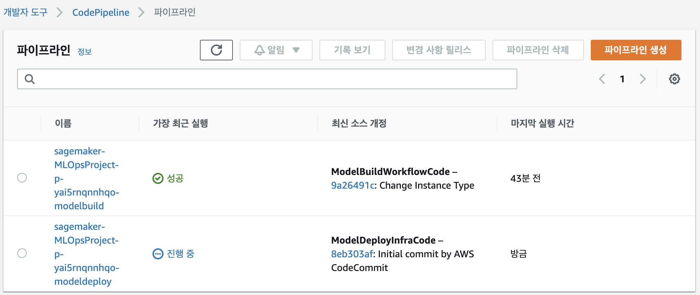

# 6. Staging 과 Production 배포

1. 웹콘솔 상단에 CodePipeline 으로 이동하여 '**파이프라인**'을 선택 합니다.

    2. EventBridge 승인을 감지하여 모델배포용 CodePipeline이 실행됩니다.

  3. Staging 배포진행이 되고, 관리자의 승인\(ApproveDeployment\)전까지 대기를 합니다.

   4. Staging 배포단계의 endpoint를 확인후 Deploy 담당자는 Production 승인진행을 합니다.

  5. Production 승인배포 확인합니다. \(Staging에서 DeployProd간에 전환을 비활성하고자 할경우 전환 비활성화를 선택할수 있습니다.\)


CodePipelines의 승인하고 Production 추론 엔드포인트가 배포되었습니다.


  6. SageMaker 메인 화면 '추론'에 Staging과 Prod 엔드포인트를 확인합니다.

    

SageMaker Project MLOps 성공적으로 마친것을 축하드립니다!!

